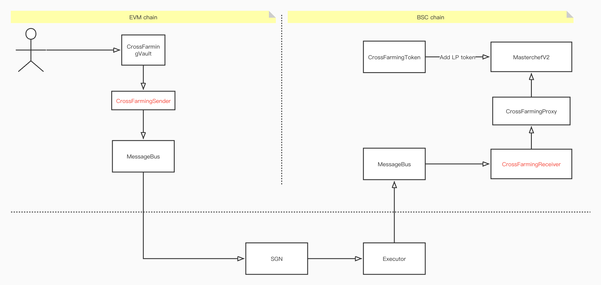

# Pancake cross farming

## Background

Pancakeswap deploy V2Swap Dex Exchange on EVM chain, like Ethereum or other EVM compatible chain.

Users who have LP tokens in our exchanges may want to make full use of these LP tokens, our design is that users cak stake LP tokens in our vault contract deployed on the EVM chain, and we send the staking messsage to the our Masterchef farm pool which deployed on BSC chain. after that the users can enjoy CAKE rewards.

we use Celer as cross-chain bridge/messagebus provider

below is celer cross-chain [workflow](https://github.com/celer-network/sgn-v2-contracts/tree/main/contracts/message#cross-chain-message-passing-only)

## Smart contract

we have 5 Main smart contract

1: CrossFarmingSender.sol

Cross-chain smart contract on EVM chain, which can send cross-chain message to dest chain, because we send cross-chain tx from this contract, so it's a sender contract

2: CrossFarmingVault.sol

A vault contract which deployed on EVM chain, user stake LP token from liquidity pool in EVM chain and the vault contract will 
call CrossFarmingSender contract to send cross-chain message to dest chain.

3: CrossFarmingReceiver.so

Cross-chain smart contract on BSC chain(receiver), it will receive user cross-chain tx message from EVM chain, then it will call user proxy contract to stake Mock LP token to Masterchef farm pools.

4: CrossFarmingProxy.sol

Every cross-chain user from EVM chain will have a proxy contract which can stake the LP token to masterchef farm pool onbehalf the user.

5: CrossFarmingToken.sol

A mintable and burnable ERC20 token as cross-farming Masterchef mock pool LP token. the token owner is CrossFarmingReceiver contract.

only the receiver contract can mint token automatically after called by celer messagebus.

below is the smart contract interact workflow.

